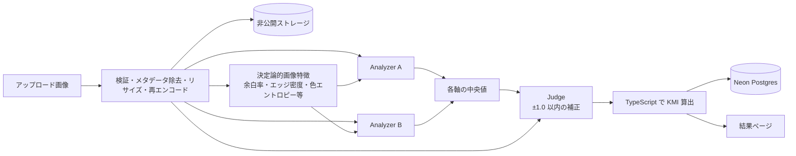

# 霞ヶ関曼荼羅 Analyzer

画像を貼り付けると、官公庁・審議会・政策資料などに見られる「霞ヶ関曼荼羅」的な情報構造を、
複数の Vision LLM と決定論的な画像処理特徴で分析し、以下を返す Web アプリです。

- **霞ヶ関曼荼羅度（KMI: Kasumigaseki Mandala Index, 0–100）** とグレード
- **胎蔵界型 / 金剛界型との形式的類似度（0–100）** と分類（`taizokai` / `kongokai` / `hybrid` / `neither`）
- **可読性スコア（0–100）** — KMI とは独立した指標
- 各評価軸（9軸）の根拠
- 画像内で確認できた中心概念・主要領域・レイアウト・判読不能箇所
- 複数 LLM の分析比較（Judge による評価）
- 最終統合レポート（Markdown）

> 本システムでいう「曼荼羅」は、密教美術の宗教的価値を評価するものではありません。
> 東京国立博物館「空海と密教美術展」の両界曼荼羅解説を参考に、**中心・階層・反復・群構造・全体世界の一枚化**
> といった空間構成上の特徴を形式的な参照モデルとして利用しています。
> また **高 KMI ＝ 悪い資料** ではありません。可読性は別指標として扱います。

仕様の全文は [docs/kasumigaseki_mandala_analyzer_spec.md](docs/kasumigaseki_mandala_analyzer_spec.md) を参照してください。

---

## 仕組み



1. 画像を PNG/JPEG/WebP として検証（マジックナンバー）、EXIF 等を除去、最大 2048px にリサイズし WebP へ再エンコード
2. SHA-256 を計算し、非公開ストレージへ保存
3. `sharp` で決定論的特徴（余白率・エッジ密度・色エントロピー・連結成分数・中心/周辺密度）を算出
4. 「霞ヶ関マスター」システムプロンプト（[prompts/kasumigaseki-master.md](prompts/kasumigaseki-master.md)）で複数の Vision LLM を並列実行し、JSON を zod で検証
5. Judge（[prompts/judge.md](prompts/judge.md)）が各回答を画像と照合し、画像上の根拠がある場合のみ各軸に −1.0〜+1.0 の補正を提案
6. `finalRaw = clamp(median + judgeAdjustment, 0, 5)` → `KMI = Σ(配点 × raw / 5)` を **必ず TypeScript 側で計算**（LLM に合計を計算させない）
7. すべてのモデル出力（raw JSON・レイテンシ・usage・prompt hash・バージョン）を保存し、結果 URL を発行

### KMI の評価軸（rubric v1）

| 評価軸 | 配点 | 定義 |
|---|---:|---|
| `centrality` 中心性 | 15 | 中央・主題となる核が視覚的/意味的に存在するか |
| `hierarchy` 階層性 | 15 | 中心→周辺、上位→下位など多層構造があるか |
| `relation_density` 関係密度 | 15 | 矢印・線・因果・循環・連携関係が密か |
| `information_density` 情報密度 | 15 | テキスト、図形、写真、アイコン等の占有密度 |
| `semantic_breadth` 意味領域の広さ | 10 | 異なる政策領域・主体・概念を一枚に統合しているか |
| `modularity` 群構造 | 10 | 色付き領域、箱、サブシステム等の群構造・反復 |
| `radial_or_grid_structure` 放射／格子構造 | 8 | 放射・同心円・グリッド等の強い空間秩序 |
| `visual_coding` 視覚的符号化 | 6 | 色・枠・アイコン・形状による多重符号化 |
| `world_closure` 世界の閉鎖性 | 6 | 「この一枚ですべてを説明する」閉じた世界観の強さ |

| KMI | グレード |
|---:|---|
| 0–19 | 非曼荼羅 |
| 20–39 | ポンチ絵 |
| 40–59 | 準曼荼羅 |
| 60–79 | 霞ヶ関曼荼羅 |
| 80–89 | 濃厚霞ヶ関曼荼羅 |
| 90–100 | 極密霞ヶ関曼荼羅 |

---

## セットアップ

### 必要なもの

- Node.js 22 以上
- Vision 対応 LLM の API キー（既定では OpenAI のみで動作します）
- （推奨）[Neon](https://neon.com/) Postgres の接続文字列。未設定の場合はインメモリ保存で動作します（開発用・再起動で消えます）

### 手順

```sh
git clone https://github.com/morimorijap/Kasumigaseki_Mandala_Analyzer.git
cd Kasumigaseki_Mandala_Analyzer
npm install

cp .env.example .env
# .env に OPENAI_API_KEY と DATABASE_URL を設定

npm run db:migrate   # Neon にテーブルを作成（DATABASE_URL を使う場合）
npm run dev          # http://localhost:3000
```

ブラウザで画像をドラッグ＆ドロップ、または `Ctrl`+`V` で貼り付けて「解析する」を押してください。
2つの Analyzer と Judge を実行するため、1 枚あたり 30 秒〜数分かかります。

### 環境変数

| 変数 | 必須 | 説明 |
|---|---|---|
| `OPENAI_API_KEY`（または `OPENAI_KEY`） | ○ | OpenAI API キー |
| `ANALYZER_MODELS` | | Analyzer に使うモデル（カンマ区切り、`provider:model`）。既定 `openai:gpt-5.4-mini,openai:gpt-4.1` |
| `JUDGE_MODEL` | | Judge に使うモデル。既定 `openai:gpt-5.4` |
| `DATABASE_URL` | 推奨 | Neon Postgres 接続文字列 |
| `NEON_STORAGE_*` | | S3 互換オブジェクトストレージ。未設定時は Postgres の `bytea` に保存 |
| `ANTHROPIC_API_KEY` / `GEMINI_API_KEY` | | `anthropic:` / `google:` プロバイダを使う場合 |
| `NEON_AI_GATEWAY_BASE_URL` / `NEON_AI_GATEWAY_TOKEN` | | OpenAI 互換ゲートウェイ（`gateway:` プロバイダ） |
| `PROMPT_VERSION` | | 解析ごとに記録されるプロンプトのバージョン名 |

その他のチューニング項目は [.env.example](.env.example) を参照してください。

対応プロバイダ: `openai`（OpenAI Chat Completions 互換）、`anthropic`（Messages API）、`google`（Gemini の OpenAI 互換エンドポイント）、`gateway`（任意の OpenAI 互換エンドポイント）。

例: 3 社のモデルで比較する場合

```sh
ANALYZER_MODELS=openai:gpt-5.4-mini,anthropic:claude-sonnet-5,google:gemini-2.5-flash
JUDGE_MODEL=openai:gpt-5.4
```

### Vercel へのデプロイ

1. Vercel プロジェクトにリポジトリを接続
2. Environment Variables に `OPENAI_API_KEY`、`DATABASE_URL`（Neon 連携で自動設定可）などを登録
3. `npm run db:migrate` をローカルから実行してテーブルを作成（`vercel env pull .env.local` で取得した接続文字列を使用）
4. デプロイ

`/api/analyze` は `maxDuration = 300` を指定しています。Hobby プランでは関数の実行時間上限が短いため、
Judge まで完走できない場合は Fluid Compute を有効にするか Pro プランを利用してください。

---

## 開発

```sh
npm run dev         # 開発サーバー
npm test            # ユニットテスト（vitest）
npm run lint        # ESLint
npm run typecheck   # tsc --noEmit
npm run build       # 本番ビルド
npm run db:migrate  # db/migrations/*.sql を DATABASE_URL に適用
```

### ディレクトリ構成

```text
app/                    Next.js App Router（トップ、結果ページ、/about、API）
  api/analyze/          POST /api/analyze  — 画像を解析し結果を返す
  api/results/[id]/     GET  /api/results/:id — 結果 JSON（画像は返さない）
components/             UI コンポーネント（ドロップゾーン、スコアカード、レーダーチャート等）
lib/
  image/                前処理（検証・メタデータ除去・再エンコード）と決定論的特徴量
  llm/                  プロバイダ抽象化、Analyzer/Judge 実行、zod スキーマ、プロンプト読込
  scoring/              rubric、KMI 計算、合議（中央値＋Judge 補正）、レポート生成
  store/                Postgres / インメモリの永続化
  storage.ts            非公開画像ストレージ（S3 互換 / Postgres bytea / メモリ）
  pipeline.ts           解析フロー全体
prompts/                霞ヶ関マスター / Judge プロンプト（Markdown）
db/migrations/          SQL マイグレーション
research/               校正（キャリブレーション）とベンチマークデータセットの計画、サンプル画像
tests/                  vitest
```

### API

`POST /api/analyze` — `multipart/form-data` で `image`（PNG/JPEG/WebP、8MB・4096px 以内。Vercel 上では 4.5MB 未満）と任意の `session`（匿名 UUID）を送信。
結果 JSON（`submission`, `final`, `analyzers`, `judge`, `versions`）を返します。

`GET /api/results/:id` — 上記と同じ形式で保存済み結果を返します。アップロード画像そのものは返しません。
全投稿を列挙する公開 API は意図的に用意していません。

---

## プライバシーと制限

- ユーザー登録はありません。ブラウザに匿名 UUID を保存し、「このブラウザの最近の解析」の表示にのみ使います
- 画像はメタデータを除去・再エンコードした上で非公開ストレージに保存されます。公開バケット・公開一覧・画像 URL はありません
- 受け付ける画像は PNG / JPEG / WebP のみ（SVG・PDF は不可）。サーバー側の上限は 8MB・4096×4096px で、マジックナンバーを検証します
- Vercel の関数リクエスト上限（4.5MB）に収まるよう、ブラウザ側で送信前に最大 2048px・3.5MB 以下へ自動縮小します（サーバーでも 2048px に縮小するため品質面の損失はありません）。`curl` 等から直接 API を叩く場合は 4.5MB 未満の画像を送ってください
- 匿名アップロードには簡易的なレート制限（既定 10 回 / 10 分 / IP）があります。本番では Vercel WAF 等の併用を推奨します

## 研究用途について

KMI v1 は「真の尺度」ではなく設計尺度です。人手ラベル付きデータで校正する計画を
[research/calibration.md](research/calibration.md)、[research/benchmark-dataset.md](research/benchmark-dataset.md) にまとめています。
すべての解析に `prompt_version` / `rubric_version` / `algorithm_version` / provider / model が保存されるため、
モデル更新によるスコアのドリフトを追跡できます。

## 参考

- 東京国立博物館「空海と密教美術展」 https://www.tnm.jp/modules/r_free_page/index.php?id=1411
- 文春オンライン「“霞が関曼荼羅”の伝統はいつまで続く？」 https://bunshun.jp/articles/-/47485
- LLMcomp https://github.com/morimorijap/LLMcomp

## ライセンス

[MIT License](LICENSE)
