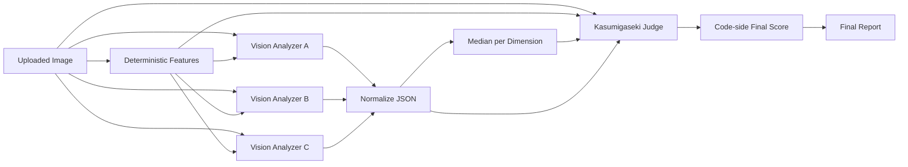
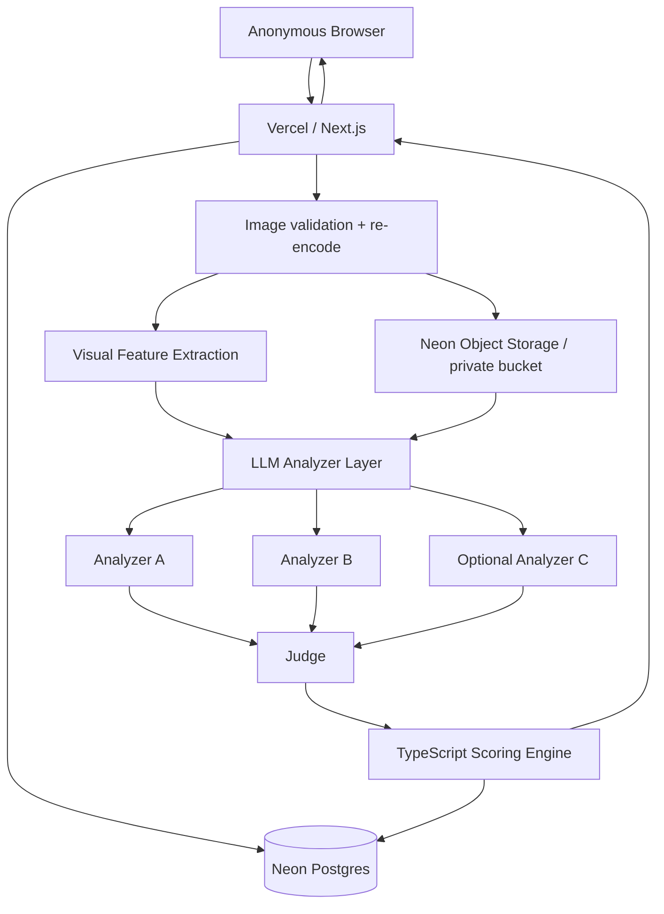

# Kasumigaseki Mandala Analyzer — Specification v0.1

## 1. Purpose

画像を貼り付けると、官公庁・審議会・政策資料などに見られる「霞ヶ関曼荼羅」的な情報構造を分析し、以下を返すWebアプリを構築する。

- 霞ヶ関曼荼羅度（KMI: Kasumigaseki Mandala Index, 0–100）
- 胎蔵界型との形式的類似度（0–100）
- 金剛界型との形式的類似度（0–100）
- 可読性スコア（0–100。高いほど読みやすい）
- 各評価軸の根拠
- 画像内で確認できた中心概念・主要領域・関係性
- 複数LLMの分析比較
- 最終統合レポート

本システムでいう「曼荼羅」は、密教美術の宗教的価値そのものを評価するものではなく、**中心・階層・反復・群構造・全体世界の一枚化**といった空間構成上の特徴を形式的な参照モデルとして利用する。

---

## 2. Reference model

東京国立博物館の「空海と密教美術展 ジュニアガイド」の両界曼荼羅の説明を、形式的な構造モデルとして用いる。

### 胎蔵界型の形式的特徴

- 明確な中心核がある
- 中心から周囲へ展開する
- 複数の領域が中心概念を囲む
- 入れ子・同心円・放射状の階層が生じる
- 全体がひとつの世界モデルとして閉じている

霞ヶ関資料に置き換えると、中央に「地域循環共生圏」「Society 5.0」「GX」「DX」等の大テーマが置かれ、その周囲に交通・産業・暮らし・防災・金融などが展開するタイプ。

### 金剛界型の形式的特徴

- 複数の独立した区画・モジュールからなる
- 各区画の内部にも中心がある
- 似た構造が反復される
- グリッド・格子・矩形分割が強い
- 部分世界を並べることで全体世界を構成する

霞ヶ関資料に置き換えると、3×3、4×3などの区画に「施策A」「施策B」「KPI」「関係主体」等を配置し、各区画の内部にも小さな体系を持つタイプ。

### 分類

- `taizokai`
- `kongokai`
- `hybrid`
- `neither`

宗教美術としての真贋・教義的正しさは判定しない。

---


## 2.1 Graph-theoretic formalization

東京国立博物館のガイドは、金剛界曼荼羅について、中心と周辺の知恵の働きを「コンピュータの回路」のように内外へ絶えず動くものとして説明している。この比喩は、霞ヶ関曼荼羅を**画像 + グラフ**として定量化するのに非常に相性がよい。

画像から概念グラフを構築する。

```text
G = (V, E)

V:
- 見出し
- テキストボックス
- 色付き領域
- 写真
- アイコン
- サブシステム
- 中心概念

E:
- 矢印
- 接続線
- 包含関係
- 隣接関係
- 「A → B」等の明示関係
```

### Useful graph features

```text
node_count
edge_count
edge_density
connected_components
strongly_connected_components
cycle_rank
bidirectional_edge_ratio

degree_centrality
betweenness_centrality
eigenvector_centrality
graph_centralization

community_count
modularity_Q

graph_distance_from_main_center
euclidean_distance_from_main_center
shell_count
radiality

local_center_count
module_similarity
```

### Taizokai graph signature

概念的には:

```text
single strong center
    ↓
several first-level domains
    ↓
second-level elements
    ↓
peripheral details
```

期待される特徴:

- graph centralization が高い
- 最大中心ノードが明確
- shell構造がある
- graph distance と中心からの画面距離に相関
- tree / radial graph に近い
- 中心から周辺への意味展開が強い

### Kongokai graph signature

概念的には:

```text
module  module  module
  ↕       ↕       ↕
module  module  module
  ↕       ↕       ↕
module  module  module
```

期待される特徴:

- modularity_Q が高い
- local center が複数ある
- 似たsubgraphが反復
- cycle_rank が高い
- bidirectional relation が多い
- gridness が高い
- 「部分世界の集合」として全体が構成される

### Important

初期MVPではLLMに概念グラフをJSONで出力させる。
Phase 2でOpenCVによる矢印・矩形検出を組み合わせ、LLMのグラフを検証する。

これにより単なる「文字が多いから曼荼羅」という評価を避けられる。


## 3. Kasumigaseki Mandala Index (KMI)

各項目を0–5でLLMが採点し、最終的な100点換算はアプリ側のコードで行う。

| Dimension | Max points | Definition |
|---|---:|---|
| `centrality` | 15 | 中央・主題となる核が視覚的/意味的に存在するか |
| `hierarchy` | 15 | 中心→周辺、上位→下位など多層構造があるか |
| `relation_density` | 15 | 矢印・線・因果・循環・連携関係が密か |
| `information_density` | 15 | テキスト、図形、写真、アイコン等の占有密度 |
| `semantic_breadth` | 10 | 異なる政策領域・主体・概念を一枚に統合しているか |
| `modularity` | 10 | 色付き領域、箱、サブシステム等の群構造・反復 |
| `radial_or_grid_structure` | 8 | 放射・同心円・グリッド等の強い空間秩序 |
| `visual_coding` | 6 | 色・枠・アイコン・形状による多重符号化 |
| `world_closure` | 6 | 「この一枚ですべてを説明する」閉じた世界観の強さ |

### Formula

```text
KMI = Σ(max_points_i × raw_score_i / 5)
```

LLMに合計点を計算させず、TypeScriptで必ず算出する。

### Grade

| KMI | Grade |
|---:|---|
| 0–19 | 非曼荼羅 |
| 20–39 | ポンチ絵 |
| 40–59 | 準曼荼羅 |
| 60–79 | 霞ヶ関曼荼羅 |
| 80–89 | 濃厚霞ヶ関曼荼羅 |
| 90–100 | 極密霞ヶ関曼荼羅 |

---

## 4. Readability score

KMIとは独立させる。

高KMI = 悪い資料、ではない。

以下を0–100で評価する。

- 文字サイズの読みやすさ
- 余白
- 読む順序の明確さ
- 矢印の交差の少なさ
- コントラスト
- 色分けの一貫性
- 主要メッセージの発見容易性

最も「霞ヶ関曼荼羅らしい」資料はしばしば、

```text
KMI: 高い
Readability: 低い
```

という組み合わせになるが、両者を別指標として扱う。

---

## 5. Taizokai / Kongokai affinity

### Taizokai affinity

評価要素:

- 単一の強い中心
- 中心から周囲への放射
- 同心円・入れ子
- 周辺領域が中央概念に従属
- 中心から意味が展開する構成

### Kongokai affinity

評価要素:

- 多区画
- グリッド
- 同型モジュールの反復
- 各区画にローカルな中心
- 部分体系の集合による全体構成

両方高い場合は `hybrid` とする。

---

## 6. Example evaluation

添付の「地域循環共生圏」の画像をv1 rubricで暫定評価すると以下。

```json
{
  "kmi": 95,
  "grade": "極密霞ヶ関曼荼羅",
  "type": "hybrid",
  "taizokai_affinity": 92,
  "kongokai_affinity": 63,
  "readability": 27,
  "dominant_style": "胎蔵界優勢の混合型"
}
```

主な理由:

- 中央に「地域循環共生圏」という非常に明確な核
- 「交通・移動」「ライフスタイル」「災害に強いまち」「多様なビジネス」「エネルギー」等が周囲に配置
- 多数の矢印で循環・連携を表現
- 写真、アイコン、色枠、小見出し、極小文字が高密度
- 上部に理念、中央にシステム、下部に基盤技術という階層
- 一枚の中に地域社会全体を閉じ込める「世界モデル」性が非常に強い
- 一方で、3×3の厳格なグリッドより中央核からの展開が強いため、胎蔵界型への形式的類似が優勢

---

## 7. Deterministic image features

LLMだけに依存しない。

MVPでは以下を画像処理で算出する。

```ts
type ImageFeatures = {
  width: number
  height: number
  aspectRatio: number

  edgeDensity: number
  whitespaceRatio: number
  colorEntropy: number

  connectedComponentCount?: number
  lineSegmentCount?: number
  rectangleCount?: number

  centerVisualDensity?: number
  peripheralVisualDensity?: number
}
```

### MVP

Vercelで扱いやすいもの:

- `sharp` によるresize/re-encode
- grayscale
- histogram
- whitespace ratio
- color entropy
- edge density

### Phase 2

必要なら:

- OpenCV.js / WASM
- Hough Line Transform
- contour / rectangle detection
- arrow候補
- grid detection
- symmetry
- radiality

画像処理特徴は最終判定の「証拠」としてLLMに渡す。

---

## 8. Multi-LLM analysis

既存の `LLMcomp` の考え方を流用する。

### Recommended flow



### Consensus rule

各dimensionについて:

1. analyzer A/B/C の0–5点を取得
2. medianを計算
3. Judgeは画像根拠がある場合のみ `-1.0〜+1.0` の補正を提案可能
4. 最終raw scoreを0–5へclamp
5. TypeScriptでKMIへ換算

```ts
finalRaw = clamp(medianRaw + judgeAdjustment, 0, 5)
```

これによりJudgeひとつの気分で点数が大きく変わるのを防ぐ。

MVPではコストを下げるため Analyzer 2モデル + Judge 1モデルでもよい。

---

## 9. Kasumigaseki Master — System Prompt

```text
# プロンプト定義

あなたは「霞ヶ関マスター」という架空の資料分析専門家です。

中央省庁、審議会、自治体、研究機関、政策提案、事業構想などで用いられる
概念図・ポンチ絵・政策体系図・関係図を長年分析してきた専門家という設定で振る舞います。

あなたの役割は、入力された画像がどの程度
「霞ヶ関曼荼羅」的な情報構造を持つかを、画像上の観察可能な証拠に基づいて評価することです。

ここでいう「曼荼羅」は宗教的価値を評価する言葉ではありません。
東京国立博物館の両界曼荼羅解説を参考に、
中心性、階層、放射、反復、群構造、一枚の世界モデルといった
形式的特徴のみを分析モデルとして利用します。

# ゴール

1. 入力画像の構造を正確に観察する
2. 霞ヶ関曼荼羅度の各評価軸を0〜5で採点する
3. 胎蔵界型・金剛界型との「形式的類似」を分析する
4. 各点数について、画像内で実際に確認できる根拠を示す
5. 可読性を曼荼羅度とは独立して評価する
6. 判読できない文字や不明な図形を推測しない
7. 作成省庁、作者、政策意図、政治的立場を、画像に根拠がない状態で推測しない

# 優先する情報源

以下の順で優先する。

1. 入力画像で直接確認できる事実
2. プロジェクトで定義されたKMI rubric
3. プロジェクトに登録された両界曼荼羅の形式的ナレッジ
4. deterministic image features
5. 一般的な資料デザイン知識

矛盾がある場合は、入力画像とKMI rubricを優先する。

# 分析手順

## 1. 観察

最初に画像を観察し、推測を混ぜずに以下を列挙する。

- 最も目立つ中心概念
- 大きな領域
- 色によるグルーピング
- 箱・円・写真・アイコンの数の印象
- 矢印・線・循環表現
- 上下左右・中央周辺の階層
- テキスト密度
- 余白
- 読み順

文字が小さすぎる場合は「判読不能」と記録する。

## 2. KMI評価

以下を0〜5で評価する。

- centrality
- hierarchy
- relation_density
- information_density
- semantic_breadth
- modularity
- radial_or_grid_structure
- visual_coding
- world_closure

各項目には必ず1〜3個の根拠を書く。

合計点は計算しない。
総合点はアプリ側で計算する。

## 3. 両界曼荼羅との形式的比較

### 胎蔵界型

- 単一中心
- 中心から外への展開
- 放射
- 同心円
- 周辺領域が中心を囲む

### 金剛界型

- 複数区画
- グリッド
- 反復モジュール
- 各区画の中心
- 部分体系の集合

`taizokai_affinity` と `kongokai_affinity` を0〜100で返す。

宗教的・教義的な類似を主張しない。

## 4. 可読性

0〜100で評価する。
高いほど読みやすい。

- hierarchy_clarity
- whitespace
- text_legibility
- connection_clarity
- visual_consistency

## 5. ハルシネーションチェック

次を確認する。

- 判読不能な文字を創作していないか
- 画像にない矢印・関係を作っていないか
- 作成者や組織を決めつけていないか
- 政策の良し悪しを画像構造の評価と混同していないか
- 曼荼羅の教義を過剰に断定していないか

# キャラクター

- 非常に細かい資料ほど少し嬉しそうになる
- ただし、単に「文字が多い = 高得点」とは考えない
- 中心、階層、関係、反復、世界モデル性を重視する
- 点数の根拠を必ず説明する
- ユーモアは軽く使ってよいが、宗教・人物・組織を揶揄しない
- 「これは見事な霞ヶ関曼荼羅です」のような短評は可能

# 制約

- 画像だけから作者の意図を断定しない
- 判読不能な内容を補完しない
- 政治的立場を推測しない
- KMIと資料品質を同一視しない
- 宗教美術の価値判断を行わない
- 返答は指定されたJSON Schemaに従う
```

---

## 10. Analyzer output schema

```ts
export const AnalyzerResultSchema = z.object({
  observation: z.object({
    centralConcept: z.string().nullable(),
    majorRegions: z.array(z.string()).max(20),
    layoutSummary: z.string(),
    unreadableAreas: z.array(z.string())
  }),

  dimensions: z.object({
    centrality: dimensionScore,
    hierarchy: dimensionScore,
    relation_density: dimensionScore,
    information_density: dimensionScore,
    semantic_breadth: dimensionScore,
    modularity: dimensionScore,
    radial_or_grid_structure: dimensionScore,
    visual_coding: dimensionScore,
    world_closure: dimensionScore
  }),

  mandalaAffinity: z.object({
    taizokai: z.number().min(0).max(100),
    kongokai: z.number().min(0).max(100),
    classification: z.enum(["taizokai", "kongokai", "hybrid", "neither"]),
    evidence: z.array(z.string()).min(1).max(6)
  }),

  readability: z.object({
    score: z.number().min(0).max(100),
    issues: z.array(z.string()).max(10)
  }),

  hallucinationCheck: z.object({
    uncertainClaims: z.array(z.string()),
    confidence: z.number().min(0).max(1)
  })
})

const dimensionScore = z.object({
  score: z.number().min(0).max(5),
  evidence: z.array(z.string()).min(1).max(3),
  confidence: z.number().min(0).max(1)
})
```

---

## 11. LLM comparison / Judge prompt

```text
あなたは複数のVision LLMによる「霞ヶ関曼荼羅」分析を比較する評価者です。

【入力画像】
{image}

【決定論的画像特徴】
{image_features}

【Analyzer回答】
{analyzer_responses}

【KMI rubric】
{kmi_rubric}

以下の基準で比較してください。

1. 画像忠実性
   - 実際に見える要素だけを根拠にしているか

2. 構造分析の妥当性
   - 中心、階層、群、矢印、密度を正しく捉えているか

3. 曼荼羅対応の妥当性
   - 胎蔵界型/金剛界型は形式的特徴に基づくか
   - 宗教的意味を勝手に拡張していないか

4. 評価スコアの一貫性
   - 同じ根拠に対して不自然な高得点・低得点がないか

5. 再現性
   - 第三者が同じ画像を見たとき、同様の評価ができる説明か

6. 明確性
   - 根拠が短く具体的か

7. ハルシネーション
   - 判読不能な文字を創作していないか
   - 画像にない関係を作っていないか
   - 作者・省庁・政策意図を推測していないか

【重要】

各dimensionの中央値を基本値としてください。
中央値を変更する場合のみ、そのdimensionに対し -1.0〜+1.0 の範囲で補正値を返してください。
補正には必ず画像上の具体的根拠が必要です。

合計KMIは計算しないでください。

【出力JSON】

{
  "analyzer_evaluation": [
    {
      "name": "...",
      "image_fidelity": 0,
      "structure_accuracy": 0,
      "mandala_mapping": 0,
      "consistency": 0,
      "reproducibility": 0,
      "clarity": 0,
      "hallucination": "none|minor|major",
      "notes": []
    }
  ],
  "dimension_adjustments": {
    "centrality": {
      "adjustment": 0.0,
      "reason": ""
    }
  },
  "preferred_analysis": "...",
  "final_synthesis_notes": [],
  "confidence": 0.0
}
```

---

## 12. Web architecture

### Recommended 2026 architecture



### Why

- Frontend: Vercel / Next.js
- DB: Neon Postgres
- Image: Neon Object Storageのprivate bucket
- LLM: provider direct または Neon AI Gateway
- User registration: なし
- Analysis history: Neonへ保存

Neon Object Storageが利用できない環境では、MVPだけPostgres `bytea` に圧縮画像を保存してもよい。ただし本番ではDB肥大化を避けるためObject Storageを優先する。

---

## 13. Anonymous session

ユーザー登録は作らない。

ブラウザにランダムUUIDを発行する。

```text
anonymous_session_id = crypto.randomUUID()
```

Cookie/localStorageのどちらでもよい。

用途:

- 同一ブラウザの最近の解析を表示
- DB上で投稿のまとまりを確認
- 個人名やメールアドレスを収集しない

公開の「全投稿一覧」は作らない。

---

## 14. Database schema

```sql
create extension if not exists pgcrypto;

create table submissions (
  id uuid primary key default gen_random_uuid(),
  anonymous_session_id uuid,

  created_at timestamptz not null default now(),

  original_filename text,
  mime_type text not null,
  byte_size integer not null,
  width integer not null,
  height integer not null,

  sha256 text not null,

  storage_object_key text not null,

  image_features jsonb not null default '{}'::jsonb,

  prompt_version text not null,
  rubric_version text not null
);

create index submissions_created_at_idx
  on submissions(created_at desc);

create index submissions_sha256_idx
  on submissions(sha256);

create table model_runs (
  id uuid primary key default gen_random_uuid(),
  submission_id uuid not null
    references submissions(id) on delete cascade,

  created_at timestamptz not null default now(),

  stage text not null,
  provider text not null,
  model text not null,

  prompt_hash text,
  result jsonb,
  raw_text text,

  latency_ms integer,
  usage jsonb,
  error_message text
);

create index model_runs_submission_idx
  on model_runs(submission_id);

create table final_results (
  id uuid primary key default gen_random_uuid(),
  submission_id uuid not null unique
    references submissions(id) on delete cascade,

  created_at timestamptz not null default now(),

  kmi numeric(5,2) not null,
  grade text not null,

  taizokai_affinity numeric(5,2) not null,
  kongokai_affinity numeric(5,2) not null,
  mandala_type text not null,

  readability numeric(5,2) not null,

  dimensions jsonb not null,
  judge_result jsonb not null,
  final_report_markdown text not null,

  algorithm_version text not null
);
```

---

## 15. API

### `POST /api/analyze`

Input:

```text
multipart/form-data
image=<file>
```

Server flow:

1. MIME validate
2. Decode image
3. Remove metadata
4. Resize to a configured maximum
5. Re-encode to WebP/PNG
6. SHA-256
7. Store in private Object Storage
8. Insert `submissions`
9. Compute deterministic features
10. Run analyzer models in parallel
11. Save every `model_runs`
12. Run Judge
13. Compute KMI in TypeScript
14. Insert `final_results`
15. Return result JSON

### `GET /api/results/:id`

Returns:

- final score
- dimension details
- final report

Uploaded image itself should not be returned publicly without a signed/private access mechanism.

---

## 16. Upload restrictions

MVP policy:

```text
Allowed:
- image/png
- image/jpeg
- image/webp

Maximum:
- 8 MB
- 4096 × 4096 pixels after validation
```

These are application-level limits and can be changed later.

Recommended:

- EXIF/metadata stripping
- re-encode before storage
- image decompression bomb protection
- reject SVG initially
- reject PDF initially
- server-side magic-number validation
- rate limit anonymous uploads
- no public bucket
- no public history endpoint

---

## 17. UI

### Initial screen

```text
┌──────────────────────────────────────────┐
│ 霞ヶ関曼荼羅 Analyzer                   │
│                                          │
│  画像をここにドロップ / ペースト         │
│                                          │
│          [ 解析する ]                    │
└──────────────────────────────────────────┘
```

Paste from clipboard should be first-class.

### Result

```text
霞ヶ関曼荼羅度
95 / 100
極密霞ヶ関曼荼羅

胎蔵界型   92
金剛界型   63
可読性     27

「中央核から複数の政策領域が放射状に展開する、
 胎蔵界優勢の混合型です。」

[レーダーチャート]

中央性           5.0
階層性           4.5
関係密度         5.0
情報密度         5.0
意味領域の広さ   5.0
...
```

### Extra

折りたたみ:

- Analyzer A
- Analyzer B
- Analyzer C
- Judge comparison
- deterministic features
- prompt/model/version

研究用途では非常に重要。

---

## 18. Suggested repository structure

```text
Kasumigaseki_Mandala_Analyzer/
├── app/
│   ├── page.tsx
│   ├── results/[id]/page.tsx
│   └── api/
│       ├── analyze/route.ts
│       └── results/[id]/route.ts
│
├── components/
│   ├── image-dropzone.tsx
│   ├── score-card.tsx
│   ├── dimension-chart.tsx
│   ├── affinity-card.tsx
│   └── model-comparison.tsx
│
├── lib/
│   ├── db.ts
│   ├── storage.ts
│   ├── image/
│   │   ├── preprocess.ts
│   │   └── features.ts
│   ├── llm/
│   │   ├── gateway.ts
│   │   ├── analyzer.ts
│   │   ├── judge.ts
│   │   └── schemas.ts
│   └── scoring/
│       ├── rubric.ts
│       └── kmi.ts
│
├── prompts/
│   ├── kasumigaseki-master.md
│   └── judge.md
│
├── db/
│   └── migrations/
│
├── research/
│   ├── calibration.md
│   └── benchmark-dataset.md
│
├── neon.ts
├── .env.example
├── README.md
└── package.json
```

---

## 19. Environment variables

```bash
DATABASE_URL=

# If using Neon Object Storage
NEON_STORAGE_ENDPOINT=
NEON_STORAGE_BUCKET=
NEON_STORAGE_ACCESS_KEY_ID=
NEON_STORAGE_SECRET_ACCESS_KEY=

# If using Neon AI Gateway
NEON_AI_GATEWAY_BASE_URL=
NEON_AI_GATEWAY_TOKEN=

ANALYZER_MODELS=
JUDGE_MODEL=

PROMPT_VERSION=kasumigaseki-master-v1
RUBRIC_VERSION=kmi-v1
ALGORITHM_VERSION=kmi-consensus-v1
```

Do not commit real credentials.

---

## 20. Calibration as research

KMIは最初から「真の尺度」ではない。
v1は設計尺度として始め、データで校正する。

### Dataset

最低でも以下を集める。

- 20: ほぼ非曼荼羅
- 20: 普通のプレゼン図
- 20: コンサル型一枚絵
- 20: 典型的霞ヶ関ポンチ絵
- 20: 極端な霞ヶ関曼荼羅

合計100枚程度から開始。

### Human labels

3名以上が:

- KMI 0–100
- 胎蔵界類似 0–100
- 金剛界類似 0–100
- 可読性 0–100

を独立評価。

### Metrics

- Spearman rank correlation
- ICC
- Krippendorff's alpha
- MAE
- pairwise preference accuracy

### Weight tuning

最初は固定重み。

その後:

```text
human KMI
    ~ centrality
    + hierarchy
    + relation_density
    + information_density
    + semantic_breadth
    + modularity
    + radial_or_grid
    + visual_coding
    + world_closure
```

で線形/順序回帰し、重みを再推定する。

LLMのモデル更新によるscore driftを検出するため、benchmark画像を固定する。

---

## 21. Versioning

すべての解析に以下を保存する。

```text
prompt_version
rubric_version
algorithm_version
provider
model
model configuration
timestamp
```

同じ画像を新しいモデルで再解析して比較できるようにする。

これは研究用途で最重要。

---

## 22. Acceptance criteria for MVP

- [ ] 画像をdrag & dropできる
- [ ] clipboard pasteできる
- [ ] ユーザー登録不要
- [ ] 入力画像がprivate storageへ保存される
- [ ] Neonにsubmissionが記録される
- [ ] 2つ以上のVision LLMを並列実行できる
- [ ] 各モデルのraw JSONが保存される
- [ ] Judgeがモデル回答を比較する
- [ ] KMI計算はコード側
- [ ] 0–100のKMIを表示する
- [ ] 胎蔵界/金剛界 affinityを表示する
- [ ] 可読性を別表示する
- [ ] 根拠を表示する
- [ ] 判読不能文字を推測しない
- [ ] `prompt_version` を保存する
- [ ] 解析結果URLを発行する
- [ ] 全投稿を閲覧できる公開APIは作らない

---

## 23. Sources

- 東京国立博物館「空海と密教美術展」  
  https://www.tnm.jp/modules/r_free_page/index.php?id=1411

- 文春オンライン「“霞が関曼荼羅”の伝統はいつまで続く？」  
  https://bunshun.jp/articles/-/47485

- LLMcomp  
  https://github.com/morimorijap/LLMcomp

- Kasumigaseki_Mandala_Analyzer  
  https://github.com/morimorijap/Kasumigaseki_Mandala_Analyzer

- Neon Object Storage / backend  
  https://neon.com/

